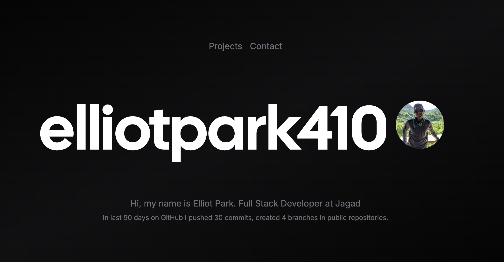

# Elliot Park's Portfolio

# 🔗 [Elliot Park's Portfolio](https://portfolio2-g4ljsqlf0-elliot-parks-projects.vercel.app/)

 

 

## Tech stack
- **Framework**: [Next.js](https://nextjs.org/)
- **Deployment**: [Vercel](https://vercel.com)
- **Styling**: [Tailwind CSS](https://tailwindcss.com), [Primer](https://primer.style/)

 

## Contact

Github: [https://github.com/elliotpark410](https://github.com/elliotpark410)
 

LinkedIn: [https://www.linkedin.com/in/elliot-park/](https://www.linkedin.com/in/elliot-park/)
 

Email: [elliotpark410@gmail.com](mailto:elliotpark410@gmail.com)
 

## License

This project is licensed under the MIT License. See the LICENSE file for details.
